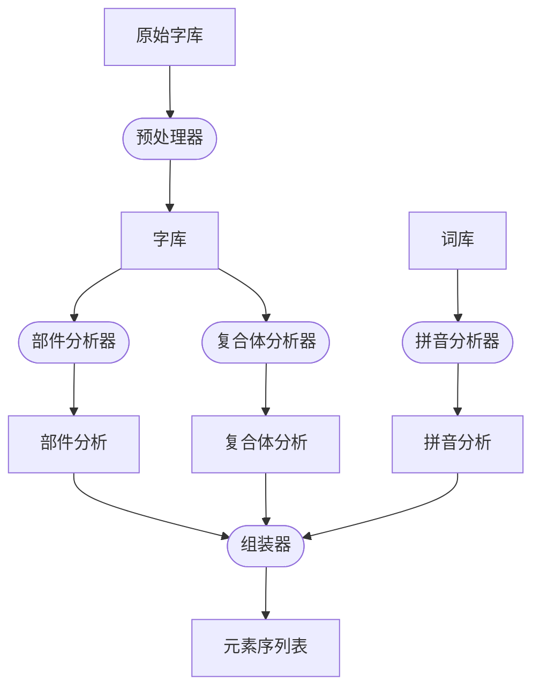

汉字自动拆分系统的设计目标是尽可能全面地涵盖一切输入方案的规则。因此，本系统采取了模块化的结构，通过组合一系列具有特定功能的组件来实现复杂的功能。下图描述了方案运行的整体流程，其中：

- 方框表示一项数据
- 圆框表示一类具有特定功能的组件，它们能够读取配置并执行相应的行为

```mermaid
graph TD
    A[原始字库] --> B([预处理器])
    B --> C[字库]

    C --> D1([部件分析器])
    C --> D2([复合体分析器])

    D1 --> E1[部件分析]
    D2 --> E2[复合体分析]

    F[词库] --> D4([拼音分析器])
    D4 --> E4[拼音分析]

    E1 --> G([组装器])
    E2 --> G
    E4 --> G

    G --> H[元素序列表]
```

以下我们将以数据和组件为中心按照流程进行讲解。
